# P & ID Automation Script

This project automates the process of identifying and verifying components on Piping and Instrumentation Diagrams (P&IDs) or Isometric Drawings through a series of steps involving data extraction, image processing, and optical character recognition (OCR).

## Prerequisites

- Python 3.10+
- Required Python packages: `pandas`, `openpyxl` or `xlrd` for Excel files, `PyMuPDF`, `Pillow`, `opencv-python`, `numpy`, `imutils`, `easyocr`, `argparse`

Ensure you have these libraries installed:

```bash
pip install pandas openpyxl PyMuPDF Pillow opencv-python numpy imutils easyocr argparse
```
Here's a flow diagram for the code provided:

```mermaid
graph TD
    A[Start] --> B[Read Excel/CSV File]
    B --> C[Filter Equipment Numbers]
    C --> D[Extract Drawing Numbers and CML ID Tags]
    D --> E[Create TML_dict]
    E --> F[Scan PDF Directory]
    F --> G[Create pdf_paths Dictionary]
    G --> H[Convert PDFs to Images]
    H --> I[Perform Template Matching]
    I --> J[Extract Coordinates for Matched Templates]
    J --> K[OCR on Image Regions]
    K --> L[Filter OCR Results by TML_dict]
    L --> M[Highlight Matched Regions on Images]
    M --> N[Save Highlighted Images]
    N --> O[End]

    style A fill:#111f5c,stroke:#333,stroke-width:4px
    style B fill:#111f5c,stroke:#f66,stroke-width:2px,stroke-dasharray: 5, 5
    style C fill:#111f5c,stroke:#f66,stroke-width:2px,stroke-dasharray: 5, 5
    style D fill:#111f5c,stroke:#f66,stroke-width:2px,stroke-dasharray: 5, 5
    style E fill:#111f5c,stroke:#f66,stroke-width:2px,stroke-dasharray: 5, 5
    style F fill:#111f5c,stroke:#f66,stroke-width:2px,stroke-dasharray: 5, 5
    style G fill:#111f5c,stroke:#f66,stroke-width:2px,stroke-dasharray: 5, 5
    style H fill:#111f5c,stroke:#f66,stroke-width:2px,stroke-dasharray: 5, 5
    style I fill:#111f5c,stroke:#f66,stroke-width:2px,stroke-dasharray: 5, 5
    style J fill:#111f5c,stroke:#f66,stroke-width:2px,stroke-dasharray: 5, 5
    style K fill:#111f5c,stroke:#f66,stroke-width:2px,stroke-dasharray: 5, 5
    style L fill:#111f5c,stroke:#f66,stroke-width:2px,stroke-dasharray: 5, 5
    style M fill:#111f5c,stroke:#f66,stroke-width:2px,stroke-dasharray: 5, 5
    style N fill:#111f5c,stroke:#f66,stroke-width:2px,stroke-dasharray: 5, 5
    style O fill:#f9f,stroke:#333,stroke-width:4px
```



## Usage

To run the script, use the following command:

```bash
python prog.py \
    --ScopeDocPath /path/to/your/scope_document.xlsx \
    --SheetName "Sheet1" \
    --PdfDirectory /path/to/pdf/directory \
    --PngDirectory /path/to/output/png/directory \
    --ZoomFactor 6 \
    --TemplatePath /path/to/your/template_image.png \
    --TemplateMatch_imgs_path /optional/path/to/save/template/matching/results \
    --highlighted_images_path /path/to/save/highlighted/images
```

### Command Line Arguments:

- **--ScopeDocPath**: Path to the Excel or CSV file containing scope information.
- **--SheetName**: Name of the sheet in the Excel file to read from. Defaults to the first sheet if not specified.
- **--PdfDirectory**: Directory containing all the Isometric PDF drawings.
- **--PngDirectory**: Directory where the converted PNG images will be saved.
- **--ZoomFactor**: Factor to zoom the PDF for conversion to PNG, increasing resolution. Default is 6.
- **--TemplatePath**: Path to the PNG image template you want to match in the drawings.
- **--TemplateMatch_imgs_path**: Optional path to save images showing template matching results. If not provided, results won't be saved.
- **--highlighted_images_path**: Path where images with highlighted matched regions will be saved.

## Project Structure

- `prog.py`: Main script to run the automation process.
- `infoExtract.py`: Contains function to extract information from Excel/CSV.
- `pdf2png.py`: Converts PDF files to PNG images.
- `TemplateMatching.py`: Performs template matching on images.
- `ocr.py`: Processes images with coordinates to perform OCR.
- `filtered_coordinate.py`: Filters OCR results based on predefined criteria.
- `highlighte.py`: Highlights the matched regions on images.

## Contribution

Feel free to fork this project, make improvements, or fix bugs. Please submit pull requests with clear descriptions of your changes.

