# P & ID Automation Script

This project automates the process of identifying and verifying components on Piping and Instrumentation Diagrams (P&IDs) or Isometric Drawings through a series of steps involving data extraction, image processing, and optical character recognition (OCR).

## Prerequisites

- Python 3.10+
- Required Python packages: `pandas`, `openpyxl` or `xlrd` for Excel files, `PyMuPDF`, `Pillow`, `opencv-python`, `numpy`, `imutils`, `easyocr`, `argparse`

Ensure you have these libraries installed:

```bash
pip install pandas openpyxl PyMuPDF Pillow opencv-python numpy imutils easyocr argparse
```
## Flow Diagram:

```mermaid
graph TD
    A[Start] --> B[Read Excel/CSV File]
    B --> C[Extract Drawing Numbers and CML ID Tags]
    C --> D[Create TML IDs from CML ID Tags]
    D --> E[Scan PDF Directory]
    E --> F[Convert PDFs to Images]
    F --> G[Perform Template Matching]
    G --> H[Extract Coordinates for Matched Templates]
    H --> I[OCR on Image Regions]
    I --> J[Highlight Matched Regions on Images]
    J --> K[Save Highlighted Images]
    K --> L[End]

    style A fill:#111f5c,stroke:#333,stroke-width:4px
    style B fill:#111f5c,stroke:#f66,stroke-width:2px,stroke-dasharray: 5, 5
    style C fill:#111f5c,stroke:#f66,stroke-width:2px,stroke-dasharray: 5, 5
    style D fill:#111f5c,stroke:#f66,stroke-width:2px,stroke-dasharray: 5, 5
    style E fill:#111f5c,stroke:#f66,stroke-width:2px,stroke-dasharray: 5, 5
    style F fill:#111f5c,stroke:#f66,stroke-width:2px,stroke-dasharray: 5, 5
    style G fill:#111f5c,stroke:#f66,stroke-width:2px,stroke-dasharray: 5, 5
    style H fill:#111f5c,stroke:#f66,stroke-width:2px,stroke-dasharray: 5, 5
    style I fill:#111f5c,stroke:#f66,stroke-width:2px,stroke-dasharray: 5, 5
    style J fill:#111f5c,stroke:#f66,stroke-width:2px,stroke-dasharray: 5, 5
    style K fill:#111f5c,stroke:#f66,stroke-width:2px,stroke-dasharray: 5, 5
    style L fill:#111f5c,stroke:#333,stroke-width:4px
```



## Functionality Breakdown

1. **Data Extraction:** The code first reads data from an Excel or CSV file, specifically filtering rows based on "Equipment Number" information. It then parses "Point" data to extract drawing numbers and CML (Computerized Maintenance Management) ID tags, creating a dictionary mapping drawing numbers to their respective CML tags.

2. **PDF to Image Conversion:** The code identifies relevant PDF isometric drawings based on the extracted drawing numbers. It then converts these PDFs into PNG images, allowing for further image processing.

3. **Template Matching:** The code uses template matching techniques to locate specific patterns (e.g., tag boxes) within the PNG images. This allows for the automatic identification of locations containing CML ID tags.

4. **OCR & Text Extraction:** Using the EasyOCR library, the code performs OCR on identified regions within the images, extracting the text contained within (i.e., the CML ID tags). 

5. **Data Filtering:** The extracted OCR results are then filtered based on the CML ID tags associated with each drawing number. Only results matching the expected tags are retained, providing a more accurate and relevant dataset.

6. **Visualization & Highlighting:** Finally, the code visualizes the filtered results by highlighting the detected regions within the original PNG images. This provides a clear and intuitive way to identify the extracted information within the drawings.


## Usage

To run the script, use the following command:

```bash
python prog.py \
    --ScopeDocPath /path/to/your/scope_document.xlsx \
    --SheetName "Sheet1" \
    --PdfDirectory /path/to/pdf/directory \
    --PngDirectory /path/to/output/png/directory \
    --ZoomFactor 6 \
    --TemplatePath /path/to/your/template_image.png \
    --TemplateMatch_imgs_path /optional/path/to/save/template/matching/results \
    --highlighted_images_path /path/to/save/highlighted/images
```

### Command Line Arguments:

- **--ScopeDocPath**: Path to the Excel or CSV file containing scope information.
- **--SheetName**: Name of the sheet in the Excel file to read from. Defaults to the first sheet if not specified.
- **--PdfDirectory**: Directory containing all the Isometric PDF drawings.
- **--PngDirectory**: Directory where the converted PNG images will be saved.
- **--ZoomFactor**: Factor to zoom the PDF for conversion to PNG, increasing resolution. Default is 6.
- **--TemplatePath**: Path to the PNG image template you want to match in the drawings.
- **--TemplateMatch_imgs_path**: Optional path to save images showing template matching results. If not provided, results won't be saved.
- **--highlighted_images_path**: Path where images with highlighted matched regions will be saved.

## Project Structure

- `prog.py`: Main script to run the automation process.
- `infoExtract.py`: Contains function to extract information from Excel/CSV.
- `pdf2png.py`: Converts PDF files to PNG images.
- `TemplateMatching.py`: Performs template matching on images.
- `ocr.py`: Processes images with coordinates to perform OCR.
- `filtered_coordinate.py`: Filters OCR results based on predefined criteria.
- `highlighte.py`: Highlights the matched regions on images.

