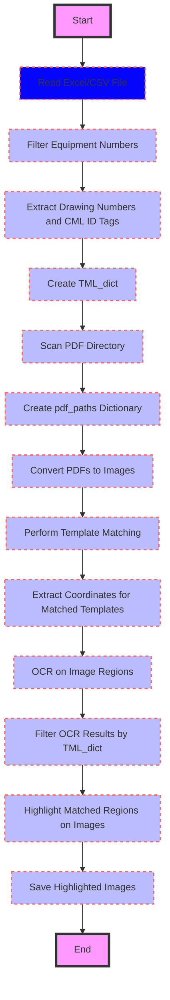

## Isometric Markup Extraction and Visualization README

This code performs a series of operations to extract and visualize relevant information from isometric drawings based on data from an Excel spreadsheet. It combines image processing, optical character recognition (OCR), and data filtering techniques to identify and highlight specific elements within the drawings.


### Functionality Breakdown

1. **Data Extraction:** The code first reads data from an Excel or CSV file, specifically filtering rows based on "Equipment Number" information. It then parses "Point" data to extract drawing numbers and CML (Computerized Maintenance Management) ID tags, creating a dictionary mapping drawing numbers to their respective CML tags.

2. **PDF to Image Conversion:** The code identifies relevant PDF isometric drawings based on the extracted drawing numbers. It then converts these PDFs into PNG images, allowing for further image processing.

3. **Template Matching:** The code uses template matching techniques to locate specific patterns (e.g., tag boxes) within the PNG images. This allows for the automatic identification of locations containing CML ID tags.

4. **OCR & Text Extraction:** Using the EasyOCR library, the code performs OCR on identified regions within the images, extracting the text contained within (i.e., the CML ID tags). 

5. **Data Filtering:** The extracted OCR results are then filtered based on the CML ID tags associated with each drawing number. Only results matching the expected tags are retained, providing a more accurate and relevant dataset.

6. **Visualization & Highlighting:** Finally, the code visualizes the filtered results by highlighting the detected regions within the original PNG images. This provides a clear and intuitive way to identify the extracted information within the drawings.


### Code Structure & Dependencies

* **Pandas:** Used for reading and manipulating data from Excel/CSV files.
* **Collections (defaultdict):** Used to create a dictionary data structure with default values for keys.
* **OS:** Used for file and directory operations.
* **Fitz (PyMuPDF):** Used for opening and rendering PDF files as images.
* **PIL (Pillow):** Used for image processing.
* **OpenCV:** Used for template matching and image manipulation.
* **Imutils:** Used for image resizing and other utilities.
* **EasyOCR:** Used for optical character recognition.
* **Regular Expressions (re):** Used for pattern matching within strings.


### Usage Instructions

1. **Install Dependencies:** Ensure all required Python libraries are installed using `pip install pandas collections os PyMuPDF Pillow opencv-python imutils easyocr`.
2. **Prepare Input Data:** Provide the path to the Excel/CSV file, the relevant sheet name, and the folder containing the PDF drawings.
3. **Configure Template & Output Paths:** Specify the path to the template image used for matching, and the desired output folder for saving results and highlighted images.
4. **Run the Code:** Execute the Python script.

### File Structure

The code expects the following file structure:

```
project_folder/
├── KFA OPIP 6 - 2022 Shot Selection - MWO 23128516 - Copy.xlsx
├── KFA OPIP 2023 Isometrics pdf format/
│   └── *.pdf
├── Template_C.png 
├── pngs/
│   └── *.png
├── Temp_out/ 
│   └── *.png
└── highlighted/
    └── *.png
```


### Notes

* The code assumes specific naming conventions for files and data fields. Adjust the code accordingly if your data or file structure differs.
* Template matching accuracy depends on the quality and clarity of the images and the template. Experiment with different templates and scaling parameters as needed.
* The OCR accuracy depends on the text clarity, font style, and language settings. Fine-tune the OCR model and parameters for optimal results.
* This code provides a basic framework for isometric markup extraction. Enhancements can be made to include more robust error handling, data validation, and user interface elements.


### Future Enhancements

* Implement a user interface for selecting input files and parameters.
* Develop a more sophisticated template matching algorithm or use machine learning models for object detection.
* Integrate a database for storing extracted data and allowing for querying and analysis.
* Create a report generation feature to summarize the extracted information.


This README provides a comprehensive overview of the project, helping users understand the functionality, dependencies, usage, and potential enhancements.


Here's a flow diagram for the code provided:



### Explanation:

- **Start/End**: The beginning and end of the process.

- **Read Excel/CSV File**: The script starts by reading data from an Excel or CSV file.

- **Filter Equipment Numbers**: It filters out rows where the equipment number is null or empty.

- **Extract Drawing Numbers and CML ID Tags**: From the filtered data, it extracts drawing numbers and CML ID tags.

- **Create TML_dict**: A dictionary (`TML_dict`) is created where keys are drawing numbers, and values are sets of CML ID tags.

- **Scan PDF Directory**: The script scans a directory for PDF files to match with drawing numbers.

- **Create pdf_paths Dictionary**: A dictionary linking drawing numbers to their respective PDF file paths.

- **Convert PDFs to Images**: Each PDF is converted into images (one image per page, but the code assumes one page for simplicity).

- **Perform Template Matching**: Images are scanned for matches against a template, finding where the template appears.

- **Extract Coordinates for Matched Templates**: Coordinates of where the template matches are extracted.

- **OCR on Image Regions**: Optical Character Recognition is performed on the regions identified by template matching to extract text.

- **Filter OCR Results by TML_dict**: The OCR results are filtered to only include text that matches the CML ID tags from `TML_dict`.

- **Highlight Matched Regions on Images**: The regions where matches were found are highlighted on the original images.

- **Save Highlighted Images**: Finally, the images with highlighted regions are saved.

This flow represents a pipeline for processing engineering drawings, identifying specific components through template matching, and verifying them through OCR against a predefined list of tags.
